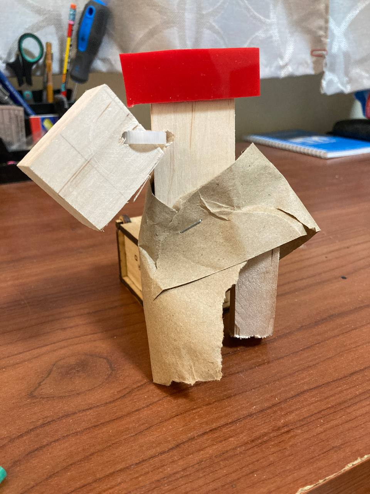

# Totem
**Создание тотема из подручных средств**

### Материалы и оборудование

- брус
- акрил

Использовано:

- [x] защитные очки и наушники;
- [x] сверлильный станок;
- [x] ножовка или дремель или мини-болгарка;
- [ ] лобзик или реноватор;
- [x] саморезы;
- [ ] болты и гайки (но не слишком много);
- [ ] надфили (напильники);
- [ ] ножницы по металлу;
- [x] шуруповерт;
- [ ] шестигранные ключи;
- [x] стяжки (тоже не слишком много);
- [x] клей ПВА, клей цианакрилатный, горячий клей;
- [x] степлер;
- [ ] эпоксидная смола и УФ;
- [x] какой-то измерительный инструмент (линейка, рулетка, штангенциркуль);
- [ ] 3D-ручка (опционально).

### Разработка и производство

Вдохновения не было. Разработка была импровизацией. Тотем изменялся в процессе появления новых идей.

[Видео. Создания тотема 1 часть](Video/РождениеТотема1.mp4)

[Видео. Создания тотема 2 часть](Video/РождениеТотема1.mp4)

### Результат

Рисунок 1- Готовый тотем 
